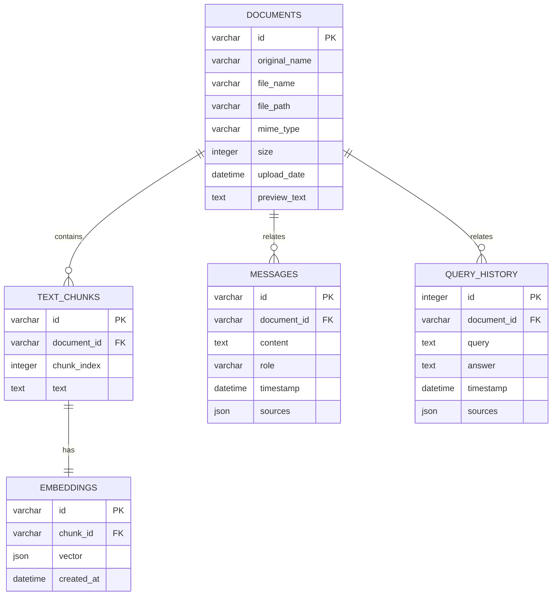
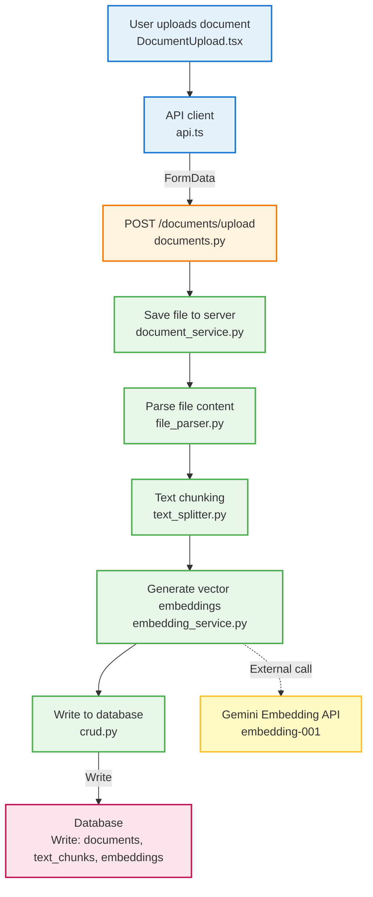
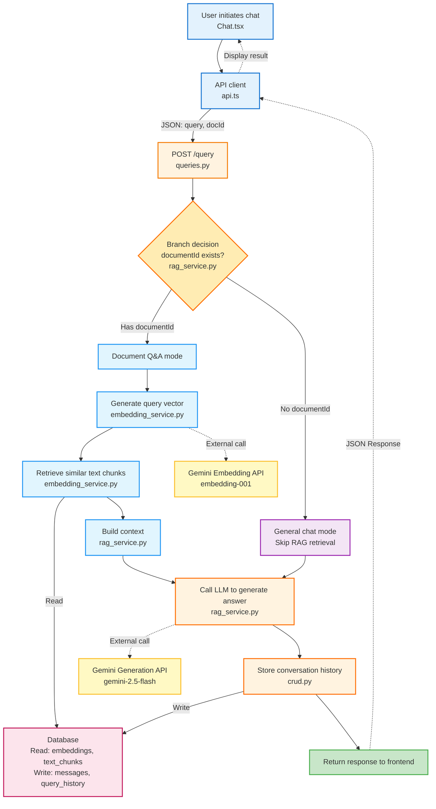

# RAG Document Q&A System

A document Q&A system based on Retrieval-Augmented Generation (RAG), integrated with Google Gemini API, supporting PDF and DOCX file uploads and intelligent Q&A. Supports two modes:
- 📄 **Document Q&A Mode**: Intelligent Q&A based on uploaded document content
- 💬 **General Chat Mode**: Free conversation with Gemini AI


## Project Structure

```
project-website-aichat/
├── backend/                    # Python FastAPI backend service
│   ├── app/                   # Application core code
│   │   ├── api/              # API routes
│   │   │   ├── documents.py  # Document management API
│   │   │   └── queries.py    # Query Q&A API
│   │   ├── models/           # Data models
│   │   │   ├── database.py   # Database configuration
│   │   │   ├── models.py     # SQLAlchemy models
│   │   │   ├── schemas.py    # Pydantic schemas
│   │   │   └── crud.py       # Database operations
│   │   ├── services/         # Business logic services
│   │   │   ├── document_service.py   # Document processing service
│   │   │   ├── embedding_service.py  # Vector embedding service
│   │   │   └── rag_service.py        # RAG Q&A service
│   │   └── utils/            # Utility functions
│   │       ├── file_parser.py        # File parsing utilities
│   │       └── text_splitter.py      # Text splitting utilities
│   ├── uploads/              # Uploaded file storage
│   ├── main.py              # FastAPI application entry point
│   ├── requirements.txt     # Python dependencies
│   ├── setup.sh            # Environment setup script
│   ├── run.sh              # Startup script
│   └── rag.db              # SQLite database
│
└── frontend/               # React frontend project
    ├── src/
    │   ├── components/     # React components
    │   │   ├── DocumentUpload.tsx    # File upload component
    │   │   ├── DocumentChat.tsx      # Document Q&A chat component
    │   │   ├── DocumentList.tsx      # Document list component
    │   │   └── ui/                   # Shadcn UI components
    │   ├── pages/
    │   │   ├── Rag.tsx               # RAG main page
    │   │   ├── Chat.tsx              # Chat page
    │   │   └── Index.tsx             # Home page
    │   ├── lib/
    │   │   ├── api.ts                # API client
    │   │   └── utils.ts              # Utility functions
    │   └── hooks/                    # React Hooks
    ├── package.json
    └── ...
```

## Tech Stack

### Backend
- **Framework**: Python + FastAPI
- **Database**: SQLite + SQLAlchemy ORM
- **Document Parsing**: PyPDF2 (PDF) + python-docx (DOCX)
- **Vector Processing**: NumPy + scikit-learn
- **AI Integration**: Google Gemini API + LangChain
- **Data Validation**: Pydantic

### Frontend
- **Framework**: React 18 + TypeScript
- **Build Tool**: Vite
- **UI Components**: Shadcn UI (based on Radix UI + Tailwind CSS)
- **Routing**: React Router
- **State Management**: TanStack Query
- **Styling**: Tailwind CSS

## 🎯 Features

### Document Management
- ✅ Support for PDF and DOCX formats
- ✅ Automatic text extraction and parsing
- ✅ Intelligent text chunking (based on page structure)
- ✅ Document preview and metadata management

### Intelligent Q&A
- ✅ High-quality answers based on Gemini 2.5-flash
- ✅ Vector semantic search for precise content matching
- ✅ Support for document mode and general chat mode
- ✅ Answer citations with traceable sources

### Conversation Management
- ✅ Complete conversation history
- ✅ Multi-document session management
- ✅ Real-time streaming message display

## Quick Start

### Method 1: One-Click Startup (Recommended)

#### Start Backend
```bash
cd backend
./setup.sh    # One-click setup of Python environment and dependencies
./run.sh      # Start backend service
```

#### Start Frontend
```bash
cd frontend
npm install   # Install dependencies
npm run dev   # Start frontend service
```

### Method 2: Manual Startup

#### Backend Setup
```bash
cd backend

# Create virtual environment (optional)
python -m venv venv
source venv/bin/activate  # Windows: venv\Scripts\activate

# Install dependencies
pip install -r requirements.txt

# Start service
python main.py
```

#### Frontend Setup
```bash
cd frontend
npm install
npm run dev
```

### Environment Variable Configuration ⚙️

**Required**: Create a `.env` file in the `backend/` directory and configure the Gemini API Key:

```env
# Google Gemini API Key (required)
GEMINI_API_KEY=your_actual_gemini_api_key_here

# Server Port (optional, default 3000)
PORT=3000
```

#### Getting Gemini API Key

1. Visit [Google AI Studio](https://aistudio.google.com/app/apikey)
2. Sign in with Google account
3. Click "Create API Key" to create a new key
4. Copy the key to the `.env` file

## 🔑 API Key Configuration Guide

### System Working Modes

The system automatically selects the working mode based on API Key configuration:

#### ✅ Normal Mode (Recommended)
After configuring a valid `GEMINI_API_KEY`:
- **Text Generation**: Uses Gemini 2.5-flash model to generate high-quality answers
- **Text Embedding**: Uses Gemini `embedding-001` model to generate semantic vectors
- **Response Speed**: Depends on network latency (typically 2-5 seconds)

#### ⚠️ Fallback Mode (For Testing)
When API Key is not configured or quota is exceeded:
- **Text Generation**: Uses simulated answers based on document content
- **Text Embedding**: Uses random vectors (similarity search still works)
- **Functionality**: All features available, but answer quality is reduced

### Quota Limits

Gemini API free tier limits:
- **Embedding API**: Daily/per-minute request limits
- **Generation API**: Relatively generous limits
- Automatically falls back to simulation mode when quota is exceeded

**Recommendations**:
- Use fallback mode for development and testing to save quota
- Use normal mode for demos and production

## Access Application

- **Frontend Application**: http://localhost:8080
- **Backend API**: http://localhost:3000
- **API Documentation**: http://localhost:3000/docs (FastAPI auto-generated)

## 📖 Usage Guide

### Method 1: Document Q&A Mode
1. Open browser and visit http://localhost:8080
2. Click "RAG" to navigate to document management page
3. Upload PDF or DOCX document (wait for processing to complete)
4. Click "Chat" to navigate to chat page
5. Select the uploaded document on the left
6. Ask questions in the input box, and the system will intelligently answer based on document content

### Method 2: General Chat Mode
1. Open browser and visit http://localhost:8080
2. Click "Chat" to navigate to chat page
3. Ask questions directly in the input box (without selecting a document)
4. The system will use Gemini AI to answer questions directly

### 💡 Usage Tips
- **Document Q&A**: Suitable for precise Q&A based on specific document content
- **General Chat**: Suitable for general knowledge Q&A and free conversation
- **View Sources**: In document Q&A mode, answers show cited original text snippets

## API Endpoints

### Document Management
- `POST /api/documents/upload` - Upload document
- `GET /api/documents` - Get all documents
- `GET /api/documents/{id}` - Get single document
- `DELETE /api/documents/{id}` - Delete document

### Query Q&A
- `POST /api/query` - Send Q&A request
  - Parameters: `documentId` (optional), `query` (required)
  - When `documentId` is empty, uses general chat mode
- `GET /api/query/history` - Get query history

## Database Design

### Database Schema

The system uses SQLite database with 5 core tables:

#### 1. Documents Table (`documents`)
Stores metadata of uploaded documents:

| Field | Type | Constraints | Description |
|------|------|------|------|
| `id` | VARCHAR | PRIMARY KEY | Document unique identifier (UUID) |
| `original_name` | VARCHAR | NOT NULL | Original filename |
| `file_name` | VARCHAR | NOT NULL | Stored filename |
| `file_path` | VARCHAR | NOT NULL | File storage path |
| `mime_type` | VARCHAR | NOT NULL | File MIME type |
| `size` | INTEGER | NOT NULL | File size (bytes) |
| `upload_date` | DATETIME | DEFAULT NOW | Upload time |
| `preview_text` | TEXT | NULL | Document preview text (first 200 characters) |

#### 2. Text Chunks Table (`text_chunks`)
Stores text chunks after document splitting:

| Field | Type | Constraints | Description |
|------|------|------|------|
| `id` | VARCHAR | PRIMARY KEY | Text chunk unique identifier (UUID) |
| `document_id` | VARCHAR | NOT NULL, FK | Associated document ID |
| `chunk_index` | INTEGER | NOT NULL | Text chunk index |
| `text` | TEXT | NOT NULL | Text chunk content |

#### 3. Embeddings Table (`embeddings`)
Stores vector representations of text chunks (for similarity search):

| Field | Type | Constraints | Description |
|------|------|------|------|
| `id` | VARCHAR | PRIMARY KEY | Embedding vector unique identifier (UUID) |
| `chunk_id` | VARCHAR | NOT NULL, FK, UNIQUE | Associated text chunk ID |
| `vector` | JSON | NOT NULL | 384-dimensional embedding vector array |
| `created_at` | DATETIME | DEFAULT NOW | Creation time |

#### 4. Messages Table (`messages`)
Stores user-AI conversation records:

| Field | Type | Constraints | Description |
|------|------|------|------|
| `id` | VARCHAR | PRIMARY KEY | Message unique identifier (UUID) |
| `document_id` | VARCHAR | NOT NULL, FK | Associated document ID |
| `content` | TEXT | NOT NULL | Message content |
| `role` | VARCHAR | NOT NULL | Message role |
| `timestamp` | DATETIME | DEFAULT NOW | Send time |
| `sources` | JSON | NULL | Citation sources (optional) |

#### 5. Query History Table (`query_history`)
Stores all Q&A history records:

| Field | Type | Constraints | Description |
|------|------|------|------|
| `id` | INTEGER | PRIMARY KEY | Auto-increment primary key |
| `document_id` | VARCHAR | NULL, FK | Associated document ID (nullable) |
| `query` | TEXT | NOT NULL | User question |
| `answer` | TEXT | NOT NULL | AI answer |
| `timestamp` | DATETIME | DEFAULT NOW | Query time |
| `sources` | JSON | NULL | Citation sources (optional) |

### Data Relationship Diagram



### Foreign Key Constraints

- `text_chunks.document_id` → `documents.id` (ON DELETE CASCADE)
- `embeddings.chunk_id` → `text_chunks.id` (ON DELETE CASCADE)
- `messages.document_id` → `documents.id` (ON DELETE CASCADE)
- `query_history.document_id` → `documents.id` (ON DELETE SET NULL)

### Index Design

- All primary keys automatically create indexes
- Foreign key fields create indexes to optimize query performance

## Data Flow Diagram

### Document Processing Flow
```
User uploads document (PDF/DOCX)
         ↓
   Frontend file upload component
         ↓
POST /api/documents/upload
         ↓
   document_service.py
         ↓
   file_parser.py (parse document)
         ↓
   text_splitter.py (text chunking)
         ↓
   embedding_service.py
         ↓
   Generate vector embeddings (simulated/Gemini API)
         ↓
   Store to SQLite database
   (Document, TextChunk, Embedding tables)
```

### Query Q&A Flow
```
User inputs question
         ↓
   Frontend chat component
         ↓
POST /api/query
         ↓
   rag_service.py
         ↓
   embedding_service.py
   (generate question's vector embedding)
         ↓
   search_similar_chunks()
   (vector similarity search)
         ↓
   Retrieve relevant document chunks
         ↓
   generate_answer()
   (simulated/Gemini API generates answer)
         ↓
   Return answer + citation sources
         ↓
   Store query history to database
         ↓
   Frontend displays answer and sources
```

## File and API Interaction Diagram

### Document Upload Flow



### Chat Query Flow


