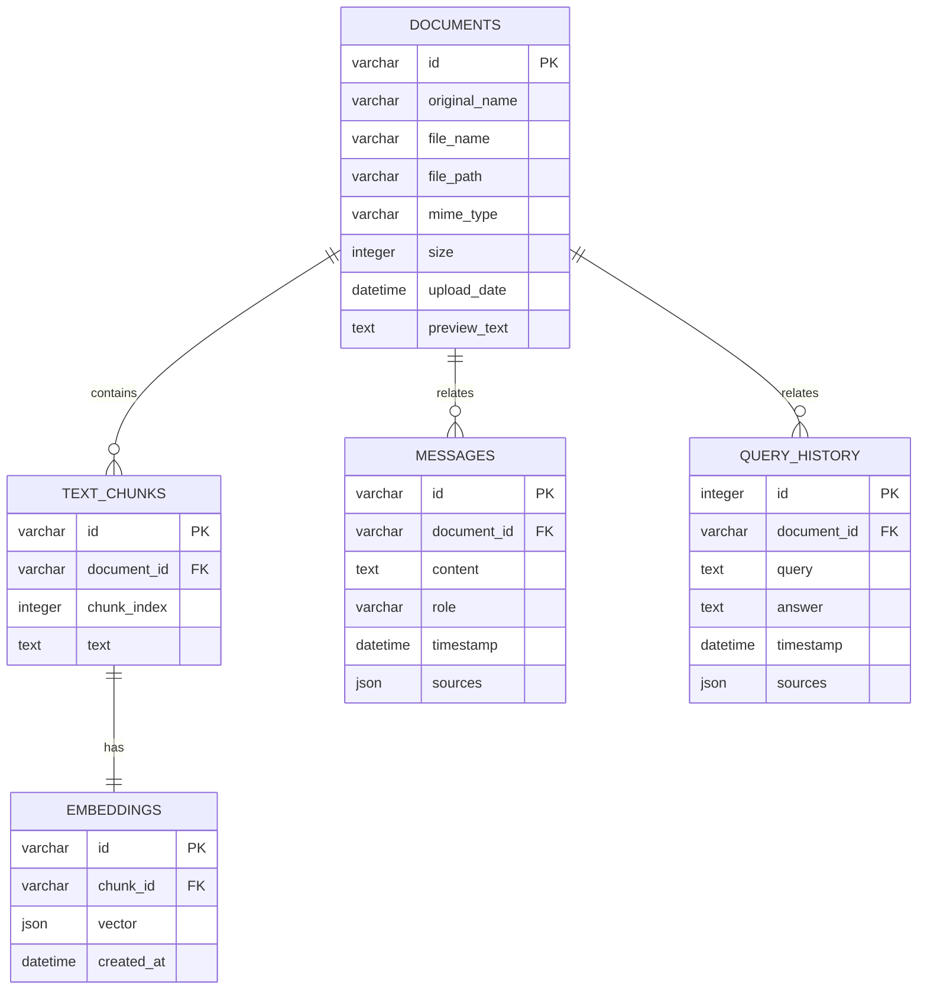
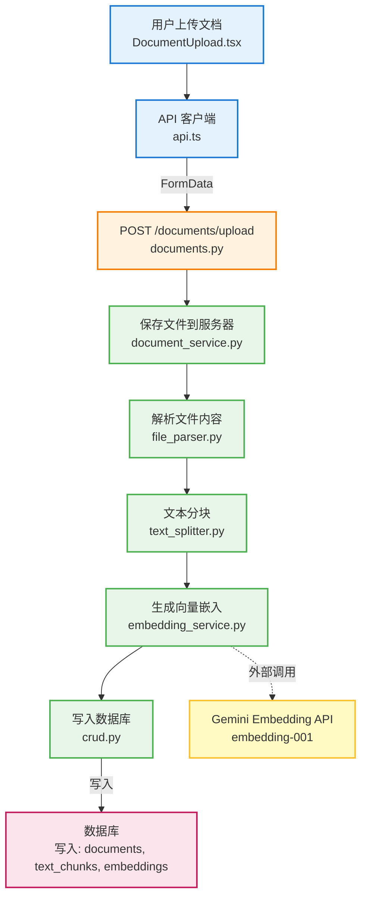
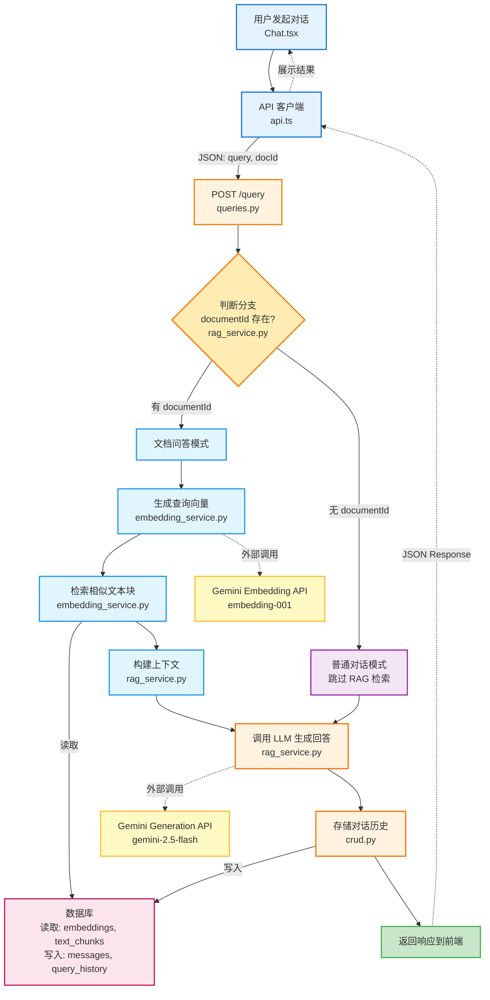

# RAG 文档问答系统

基于检索增强生成(RAG)的文档问答系统，集成 Google Gemini API，支持 PDF 和 DOCX 文件的上传和智能问答。支持两种模式：
- 📄 **文档问答模式**：基于上传的文档内容进行智能问答
- 💬 **普通对话模式**：与 Gemini AI 进行自由对话


## 项目结构

```
project-website-aichat/
├── backend/                    # Python FastAPI 后端服务
│   ├── app/                   # 应用核心代码
│   │   ├── api/              # API路由
│   │   │   ├── documents.py  # 文档管理API
│   │   │   └── queries.py    # 查询问答API
│   │   ├── models/           # 数据模型
│   │   │   ├── database.py   # 数据库配置
│   │   │   ├── models.py     # SQLAlchemy模型
│   │   │   ├── schemas.py    # Pydantic模式
│   │   │   └── crud.py       # 数据库操作
│   │   ├── services/         # 业务逻辑服务
│   │   │   ├── document_service.py   # 文档处理服务
│   │   │   ├── embedding_service.py  # 向量嵌入服务
│   │   │   └── rag_service.py        # RAG问答服务
│   │   └── utils/            # 工具函数
│   │       ├── file_parser.py        # 文件解析工具
│   │       └── text_splitter.py      # 文本分割工具
│   ├── uploads/              # 上传文件存储
│   ├── main.py              # FastAPI应用入口
│   ├── requirements.txt     # Python依赖
│   ├── setup.sh            # 环境设置脚本
│   ├── run.sh              # 启动脚本
│   └── rag.db              # SQLite数据库
│
└── frontend/               # React前端项目
    ├── src/
    │   ├── components/     # React组件
    │   │   ├── DocumentUpload.tsx    # 文件上传组件
    │   │   ├── DocumentChat.tsx      # 文档问答聊天组件
    │   │   ├── DocumentList.tsx      # 文档列表组件
    │   │   └── ui/                   # Shadcn UI组件
    │   ├── pages/
    │   │   ├── Rag.tsx               # RAG主页面
    │   │   ├── Chat.tsx              # 聊天页面
    │   │   └── Index.tsx             # 首页
    │   ├── lib/
    │   │   ├── api.ts                # API客户端
    │   │   └── utils.ts              # 工具函数
    │   └── hooks/                    # React Hooks
    ├── package.json
    └── ...
```

## 技术栈

### 后端
- **框架**: Python + FastAPI
- **数据库**: SQLite + SQLAlchemy ORM
- **文档解析**: PyPDF2 (PDF) + python-docx (DOCX)
- **向量处理**: NumPy + scikit-learn
- **AI集成**: Google Gemini API + LangChain
- **数据验证**: Pydantic

### 前端
- **框架**: React 18 + TypeScript
- **构建工具**: Vite
- **UI组件**: Shadcn UI (基于 Radix UI + Tailwind CSS)
- **路由**: React Router
- **状态管理**: TanStack Query
- **样式**: Tailwind CSS

## 🎯 功能特性

### 文档管理
- ✅ 支持 PDF 和 DOCX 格式
- ✅ 自动文本提取和解析
- ✅ 智能文本分块（基于页面结构）
- ✅ 文档预览和元数据管理

### 智能问答
- ✅ 基于 Gemini 2.5-flash 的高质量回答
- ✅ 向量语义搜索，精准匹配相关内容
- ✅ 支持文档模式和普通对话模式
- ✅ 回答引用原文，可追溯来源

### 对话管理
- ✅ 完整的对话历史记录
- ✅ 多文档会话管理
- ✅ 实时消息流式展示

## 快速开始

### 方法一：一键启动 (推荐)

#### 启动后端
```bash
cd backend
./setup.sh    # 一键设置Python环境和依赖
./run.sh      # 启动后端服务
```

#### 启动前端
```bash
cd frontend
npm install   # 安装依赖
npm run dev   # 启动前端服务
```

### 方法二：手动启动

#### 后端设置
```bash
cd backend

# 创建虚拟环境 (可选)
python -m venv venv
source venv/bin/activate  # Windows: venv\Scripts\activate

# 安装依赖
pip install -r requirements.txt

# 启动服务
python main.py
```

#### 前端设置
```bash
cd frontend
npm install
npm run dev
```

### 环境变量配置 ⚙️

**必需**：在 `backend/` 目录创建 `.env` 文件并配置 Gemini API Key：

```env
# Google Gemini API Key (必需)
GEMINI_API_KEY=your_actual_gemini_api_key_here

# Server Port (可选，默认3000)
PORT=3000
```

#### 获取 Gemini API Key

1. 访问 [Google AI Studio](https://aistudio.google.com/app/apikey)
2. 登录 Google 账号
3. 点击 "Create API Key" 创建新密钥
4. 复制密钥到 `.env` 文件

## 🔑 API Key 配置说明

### 系统工作模式

系统会根据 API Key 配置自动选择工作模式：

#### ✅ 正常模式（推荐）
配置了有效的 `GEMINI_API_KEY` 后：
- **文本生成**：使用 Gemini 2.5-flash 模型生成高质量回答
- **文本嵌入**：使用 Gemini `embedding-001` 模型生成语义向量
- **响应速度**：取决于网络延迟（通常 2-5 秒）

#### ⚠️ 降级模式（测试用）
未配置 API Key 或配额超限时：
- **文本生成**：使用基于文档内容的模拟回答
- **文本嵌入**：使用随机向量（仍可进行相似度搜索）
- **功能完整性**：所有功能可用，但回答质量降低

### 配额限制

Gemini API 免费层限制：
- **嵌入 API**：每日/每分钟有请求次数限制
- **生成 API**：相对宽松的限制
- 超出配额后会自动降级到模拟模式

**建议**：
- 开发测试时使用降级模式节省配额
- 演示和生产时使用正常模式

## 访问应用

- **前端应用**: http://localhost:8080
- **后端API**: http://localhost:3000
- **API文档**: http://localhost:3000/docs (FastAPI自动生成)

## 📖 使用指南

### 方式一：文档问答模式
1. 打开浏览器访问 http://localhost:8080
2. 点击 "RAG" 导航到文档管理页面
3. 上传 PDF 或 DOCX 文档（等待处理完成）
4. 点击 "Chat" 导航到聊天页面
5. 在左侧选择已上传的文档
6. 在输入框中提问，系统会基于文档内容智能回答

### 方式二：普通对话模式
1. 打开浏览器访问 http://localhost:8080
2. 点击 "Chat" 导航到聊天页面
3. 直接在输入框中提问（不选择文档）
4. 系统会使用 Gemini AI 直接回答问题

### 💡 使用技巧
- **文档问答**：适合需要基于特定文档内容的精确问答
- **普通对话**：适合通用知识问答和自由对话
- **查看来源**：文档问答模式下，回答会显示引用的原文片段

## API接口

### 文档管理
- `POST /api/documents/upload` - 上传文档
- `GET /api/documents` - 获取所有文档
- `GET /api/documents/{id}` - 获取单个文档
- `DELETE /api/documents/{id}` - 删除文档

### 问答查询
- `POST /api/query` - 发送问答请求
  - 参数：`documentId` (可选), `query` (必需)
  - `documentId` 为空时使用普通对话模式
- `GET /api/query/history` - 获取查询历史

## 数据库设计

### 数据库Schema

系统使用SQLite数据库，包含5个核心表：

#### 1. 文档表 (`documents`)
存储上传文档的元数据信息：

| 字段 | 类型 | 约束 | 说明 |
|------|------|------|------|
| `id` | VARCHAR | PRIMARY KEY | 文档唯一标识符 (UUID) |
| `original_name` | VARCHAR | NOT NULL | 原始文件名 |
| `file_name` | VARCHAR | NOT NULL | 存储文件名 |
| `file_path` | VARCHAR | NOT NULL | 文件存储路径 |
| `mime_type` | VARCHAR | NOT NULL | 文件MIME类型 |
| `size` | INTEGER | NOT NULL | 文件大小（字节） |
| `upload_date` | DATETIME | DEFAULT NOW | 上传时间 |
| `preview_text` | TEXT | NULL | 文档预览文本（前200字符） |

#### 2. 文本块表 (`text_chunks`)
存储文档分割后的文本片段：

| 字段 | 类型 | 约束 | 说明 |
|------|------|------|------|
| `id` | VARCHAR | PRIMARY KEY | 文本块唯一标识符 (UUID) |
| `document_id` | VARCHAR | NOT NULL, FK | 关联的文档ID |
| `chunk_index` | INTEGER | NOT NULL | 文本块索引 |
| `text` | TEXT | NOT NULL | 文本块内容 |

#### 3. 嵌入向量表 (`embeddings`)
存储文本块的向量表示（用于相似度搜索）：

| 字段 | 类型 | 约束 | 说明 |
|------|------|------|------|
| `id` | VARCHAR | PRIMARY KEY | 嵌入向量唯一标识符 (UUID) |
| `chunk_id` | VARCHAR | NOT NULL, FK, UNIQUE | 关联的文本块ID |
| `vector` | JSON | NOT NULL | 384维嵌入向量数组 |
| `created_at` | DATETIME | DEFAULT NOW | 创建时间 |

#### 4. 消息表 (`messages`)
存储用户与AI的对话记录：

| 字段 | 类型 | 约束 | 说明 |
|------|------|------|------|
| `id` | VARCHAR | PRIMARY KEY | 消息唯一标识符 (UUID) |
| `document_id` | VARCHAR | NOT NULL, FK | 关联的文档ID |
| `content` | TEXT | NOT NULL | 消息内容 |
| `role` | VARCHAR | NOT NULL | 消息角色 |
| `timestamp` | DATETIME | DEFAULT NOW | 发送时间 |
| `sources` | JSON | NULL | 引用来源（可选） |

#### 5. 查询历史表 (`query_history`)
存储所有问答的历史记录：

| 字段 | 类型 | 约束 | 说明 |
|------|------|------|------|
| `id` | INTEGER | PRIMARY KEY | 自增主键 |
| `document_id` | VARCHAR | NULL, FK | 关联的文档ID（可为空） |
| `query` | TEXT | NOT NULL | 用户问题 |
| `answer` | TEXT | NOT NULL | AI回答 |
| `timestamp` | DATETIME | DEFAULT NOW | 查询时间 |
| `sources` | JSON | NULL | 引用来源（可选） |

### 数据关系图



### 外键约束

- `text_chunks.document_id` → `documents.id` (ON DELETE CASCADE)
- `embeddings.chunk_id` → `text_chunks.id` (ON DELETE CASCADE)
- `messages.document_id` → `documents.id` (ON DELETE CASCADE)
- `query_history.document_id` → `documents.id` (ON DELETE SET NULL)

### 索引设计

- 所有主键自动创建索引
- 外键字段创建索引以优化查询性能

## 数据流程图

### 文档处理流程
```
用户上传文档 (PDF/DOCX)
         ↓
   前端文件上传组件
         ↓
POST /api/documents/upload
         ↓
   document_service.py
         ↓
   file_parser.py (解析文档)
         ↓
   text_splitter.py (文本分块)
         ↓
   embedding_service.py
         ↓
   生成向量嵌入 (模拟/Gemini API)
         ↓
   存储到 SQLite 数据库
   (Document, TextChunk, Embedding 表)
```

### 问答查询流程
```
用户输入问题
         ↓
   前端聊天组件
         ↓
POST /api/query
         ↓
   rag_service.py
         ↓
   embedding_service.py
   (生成问题的向量嵌入)
         ↓
   search_similar_chunks()
   (向量相似度搜索)
         ↓
   检索相关文档片段
         ↓
   generate_answer()
   (模拟/Gemini API 生成回答)
         ↓
   返回答案 + 引用来源
         ↓
   存储查询历史到数据库
         ↓
   前端显示回答和来源
```

## 文件与API交互图

### 文档上传流程



### 对话查询流程


